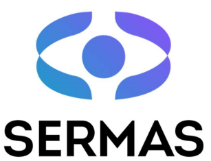

# AIM – Augmented Reality for Energy Infrastructure Management (XR Client)

**AIM** is a XR client for **Vuzix Blade 2** smart glasses. It renders GIS/3D utility data and field workflows in a hands‑free AR experience by loading a **web UI** (CesiumJS + SERMAS) in a secure WebView.

Developed by **Xilbi Sistemas de Informacion SL**

The Augmented Reality System for Energy Infrastructure Management (AIM) has indirectly received funding from the European Union, via the SERMAS OC2 DEMONSTRATE issued and executed under the SERMAS project (Grant Agreement no. 101070351). Views and opinions expressed are however those of the author(s) only and do not necessarily reflect those of the European Union or SERMAS. Neither the European Union nor SERMAS can be held responsible for them.
<p align="center">
    

</p>
> 🧰 **SERMAS Toolkit setup**: We **do not** provide server setup here. Please follow the official documentation at **[https://sermasproject.eu/sermas-toolkit/](https://sermasproject.eu/sermas-toolkit/)** (read the docs, follow the guides, and deploy the required services). Once your SERMAS URL is ready, point this client to it (see **Configuration**).


---

## Table of Contents

* [Features](#features)
* [Requirements](#requirements)
* [Project Structure](#project-structure)
* [Vuzix Blade 2 Device Profile (Required)](#vuzix-blade-2-device-profile-required)
* [Cesium Web UI Setup (Required)](#cesium-web-ui-setup-required)
* [Configuration](#configuration)
* [Build & Install (Android Studio)](#build--install-android-studio)
* [Build & Install (CLI)](#build--install-cli)
* [First‑Run Checklist](#first-run-checklist)
* [Troubleshooting](#troubleshooting)
* [Security & Privacy](#security--privacy)
* [License](#license)
* [Acknowledgments](#acknowledgments)

---

## Features

* **XR on Blade 2**: WebView‑based AIM interface optimized for smart‑glasses.
* **Voice‑first UX**: Uses device microphone for voice commands (internet required for cloud AI services unless you deploy an on‑prem fallback).
* **Cesium 3D**: Web‑based 3D map (CesiumJS) for assets and overlays.
* **Portable**: Android 11+, standard Android APIs + `androidx.webkit` (no vendor lock‑in).

---

## Requirements

**Hardware**

* **Vuzix Blade 2** (Android 11) with Wi‑Fi and USB for ADB.
* Optional BT headset/mic for noisy sites.

**Development environment**

* **Android Studio** Koala (or newer), **Android SDK 34**, **JDK 17**.
* `adb` (bundled with Android Studio).

**Back‑end & Web**

* A reachable **SERMAS Toolkit** instance (UI gateway + services).
  👉 [https://sermasproject.eu/sermas-toolkit/](https://sermasproject.eu/sermas-toolkit/)
* **CesiumJS web page** served via HTTPS (can be part of your SERMAS UI gateway or any static web host).
* A **Cesium ion** account and **ion access token** for terrain/imagery/3D Tiles.

---

## Project Structure

```
AIM/
├─ app/
│  ├─ src/main/AndroidManifest.xml
│  ├─ src/main/java/.../MainActivity.kt
│  └─ src/main/res/...
├─ webui/cesium-client/           # (recommended location for your web page)
│  ├─ index.html
│  ├─ config.json                 # contains ion token & dataset URLs/IDs (do not commit real tokens)
│  └─ assets/...
├─ build.gradle
├─ settings.gradle
└─ gradle.properties
```

* `MainActivity.kt` hosts the WebView and **loads your Cesium/SERMAS UI URL**.
* `webui/cesium-client/` is a suggested folder for your Cesium web page.

---

## Vuzix Blade 2 Device Profile (Required)

To ensure consistent setup (Wi‑Fi, locale, power/display behavior, permissions, etc.) you **must create and apply a Blade 2 device profile** before installing AIM.

1. Open the official Vuzix guide: **[https://support.vuzix.com/docs/creating-a-device-profile](https://support.vuzix.com/docs/creating-a-device-profile)**
2. Follow the instructions to **create a device profile** for Blade 2 and **apply it** to your device(s).
3. After applying the profile, verify:

   * Network connectivity (Wi‑Fi(s) your crews will use)
   * Date/time, language/locale (match your command language)
   * Display/sleep settings appropriate for field use
   * Microphone/camera permissions policy as per your organization
   * (If developing) Developer options / USB debugging enabled

> For fleets, consider managing profiles centrally via your chosen enterprise/MDM tooling (per Vuzix guidance). Exact steps depend on your environment—please follow the Vuzix documentation linked above.

---

## Cesium Web UI Setup (Required)

You must provide a **web page** that the Blade 2 app opens in its WebView. This page renders the 3D map and overlays via **CesiumJS** and connects to SERMAS services.

### 1) Get a Cesium ion token

* Create a Cesium ion account and generate an **Access Token**.
* **Best practice:** restrict the token by domain (your HTTPS host) and **do not commit** real tokens to Git. Use a config file served by your backend (see below).

### 2) Minimal `index.html` (example)

```html
<!doctype html>
<html lang="en">
<head>
  <meta charset="utf-8" />
  <title>AIM – Cesium Client</title>
  <link rel="stylesheet"
        href="https://cdn.jsdelivr.net/npm/cesium@latest/Build/Cesium/Widgets/widgets.css" />
  <style>
    html, body, #cesiumContainer { width:100%; height:100%; margin:0; padding:0; overflow:hidden; }
  </style>
</head>
<body>
  <div id="cesiumContainer"></div>

  <script src="https://cdn.jsdelivr.net/npm/cesium@latest/Build/Cesium/Cesium.js"></script>
  <script>
    // Load runtime configuration (served securely by your backend)
    fetch('config.json').then(r => r.json()).then(async CONFIG => {
      Cesium.Ion.defaultAccessToken = CONFIG.ionToken; // DO NOT hardcode in source control

      const viewer = new Cesium.Viewer('cesiumContainer', {
        terrainProvider: await Cesium.createWorldTerrainAsync(),
        imageryProvider: new Cesium.IonImageryProvider({ assetId: CONFIG.imageryAssetId }),
        timeline: false, animation: false, selectionIndicator: false,
      });

      // Example: load a 3D Tiles asset (utilities, cables, etc.)
      if (CONFIG.tilesets && CONFIG.tilesets.length) {
        for (const t of CONFIG.tilesets) {
          const tileset = await Cesium.Cesium3DTileset.fromIonAssetId(t.assetId);
          viewer.scene.primitives.add(tileset);
        }
      }

      // Listen for intents coming from Android/WebView or SERMAS
      window.addEventListener('aim-intent', (e) => {
        const { type, layer } = e.detail || {};
        if (type === 'showLayer') { /* toggle layer visible */ }
        if (type === 'hideLayer') { /* toggle layer hidden */ }
        if (type === 'goto') { /* flyTo coordinates/assetId */ }
      });

      // Optional: expose a small API back to Android
      window.AIM = {
        ready: () => true,
        setLayerVisible: (name, visible) => { /* ... */ }
      };
    });
  </script>
</body>
</html>
```

### 3) Example `config.json` (served by your backend)

```json
{
  "ionToken": "YOUR_CESIUM_ION_TOKEN",
  "imageryAssetId": 2,
  "tilesets": [
    { "name": "utilities", "assetId": 123456 }
  ],
  "sermas": {
    "apiBaseUrl": "https://your-sermas.example/api",
    "wsUrl": "wss://your-sermas.example/ws"
  }
}
```

> **Do not commit real tokens.** Serve this file behind your authenticated UI gateway (SERMAS).

### 4) Integrate with the SERMAS environment

You have two integration paths (you can use both):

**A. Inside the WebView (Android ↔ JS bridge)**

```kotlin
// Android -> JS: dispatch a custom event into the page
webView.evaluateJavascript("""
  window.dispatchEvent(new CustomEvent('aim-intent', { detail: { type: 'showLayer', layer: 'water' } }));
""".trimIndent(), null)
```

```kotlin
// JS -> Android: expose a bridge
webView.addJavascriptInterface(object {
    @android.webkit.JavascriptInterface
    fun onAssetSelected(id: String) { /* forward to SERMAS / log */ }
}, "AIMBridge")
```

```js
// In your web page
if (window.AIMBridge) { window.AIMBridge.onAssetSelected(assetId); }
```

**B. Directly to SERMAS (Web ↔ SERMAS)**

* The Cesium page can call SERMAS **REST**/**WebSocket** endpoints using `sermas.apiBaseUrl` / `sermas.wsUrl` from `config.json` (e.g., layer toggles from dialogue intents; asset selection back to dialogue).

> **Hosting**: Serve the Cesium page (and `config.json`) from your SERMAS UI gateway or any HTTPS host with correct **CORS** and **Content Security Policy** for WebView.

### 5) Security & token handling

* **Never hardcode** production ion tokens in source control.
* Restrict tokens to your domain(s) where possible.
* Use HTTPS everywhere.
* Keep Cesium attribution visible per license.

---

## Configuration

1. **Point the app to your Web UI**
   Edit `app/src/main/java/.../MainActivity.kt`:

   ```kotlin
   private fun loadWebPage() {
       // Replace with your hosted Cesium/SERMAS page (HTTPS)
       webView.loadUrl("https://YOUR-HOST/cesium-client/index.html")
   }
   ```

2. **Network (dev)**
   For self‑signed TLS in development, either install your CA on the device or add a debug‑only `networkSecurityConfig`. Do not ship relaxed configs to production.

3. **WebView settings**

   ```kotlin
   webView.settings.javaScriptEnabled = true
   webView.settings.domStorageEnabled = true
   webView.settings.mediaPlaybackRequiresUserGesture = false
   ```

4. **Mic permission**
   Voice features need microphone permission (prompted at runtime).

---

## Build & Install (Android Studio)

1. **Enable Developer Options** on Blade 2 (Settings → System → About → tap **Build number** 7x).
2. In **Developer options**: enable **USB debugging** (ADB over Wi‑Fi optional).
3. Open project in Android Studio and let Gradle sync.
4. Select build variant `debug` (test) or `release` (distribution).
5. Connect Blade 2 and press **Run ▶** (or build APK and `adb install -r`).

---

## Build & Install (CLI)

```bash
# Build debug APK
./gradlew assembleDebug

# Verify device
adb devices

# Install
adb install -r app/build/outputs/apk/debug/app-debug.apk
```

For release builds, configure signing in `app/build.gradle` and run `./gradlew assembleRelease`.

---

## First‑Run Checklist

* **Device profile**: Blade 2 profile created & applied per Vuzix docs → [https://support.vuzix.com/docs/creating-a-device-profile](https://support.vuzix.com/docs/creating-a-device-profile)
* **SERMAS**: Toolkit running and reachable over HTTPS.
* **Cesium page**: Hosted and accessible at the URL configured in `loadWebPage()`.
* **Ion token**: Valid and loaded via `config.json` (do not hardcode).
* **Device**: Blade 2 on Wi‑Fi, microphone permission granted.
* **Inspect**: Use Chrome `chrome://inspect#devices` to debug the WebView (console/network).

---

## Troubleshooting

**Blank page / CORS / CSP**

* Serve the page via HTTPS and set proper CORS headers for your SERMAS APIs.
* Check console in `chrome://inspect#devices` for blocked requests.

**Cesium fails to load terrain/imagery**

* Verify **ion token** (scope, domain restrictions), asset IDs, and HTTPS.

**Voice doesn’t work**

* Verify mic permission.
* Remember: cloud AI services require internet unless you deploy an **on‑prem STT/NLU** fallback.

**ADB doesn’t see the device**

* Toggle USB debugging, try a different cable/port, accept the “Allow USB debugging” dialog on device.

**Performance / text size**

* Blade 2 has a small display area. Adjust zoom/scale in your Cesium/SERMAS UI if needed. Reduce heavy 3D tilesets for smoother rendering.

---

## Security & Privacy

* **Transport**: Use **HTTPS** end-to-end (app ↔ Cesium page ↔ SERMAS).
* **Auth**: SERMAS manages access control; secure the Cesium page behind the same gateway when possible.
* **Tokens**: Keep ion tokens out of source control; serve via authenticated config.
* **Privacy**: `RECORD_AUDIO` is requested solely for voice features. Follow your internal policies and SERMAS guidance.

> For SERMAS server hardening, RBAC, and data retention, see **[https://sermasproject.eu/sermas-toolkit/](https://sermasproject.eu/sermas-toolkit/)**.

---

## License

Add your license (MIT/Apache‑2.0, etc.) and include a `LICENSE` file.

---

## Acknowledgments

* The Augmented Reality System for Energy Infrastructure Management (AIM) has indirectly received funding from the European Union, via the SERMAS OC2 DEMONSTRATE issued and executed under the SERMAS project (Grant Agreement no. 101070351). Views and opinions expressed are however those of the author(s) only and do not necessarily reflect those of the European Union or SERMAS. Neither the European Union nor SERMAS can be held responsible for them.

---

### Quick Start (TL;DR)

1. Create & apply **Vuzix Blade 2 device profile** → **[https://support.vuzix.com/docs/creating-a-device-profile](https://support.vuzix.com/docs/creating-a-device-profile)**
2. Deploy SERMAS → **[https://sermasproject.eu/sermas-toolkit/](https://sermasproject.eu/sermas-toolkit/)**
3. Build a **CesiumJS** web page and host it via HTTPS (with **ion token** served from `config.json`)
4. Set the page URL in `MainActivity.kt → loadWebPage()`
5. Build & install on **Vuzix Blade 2** → grant mic permission → test in the field

---
